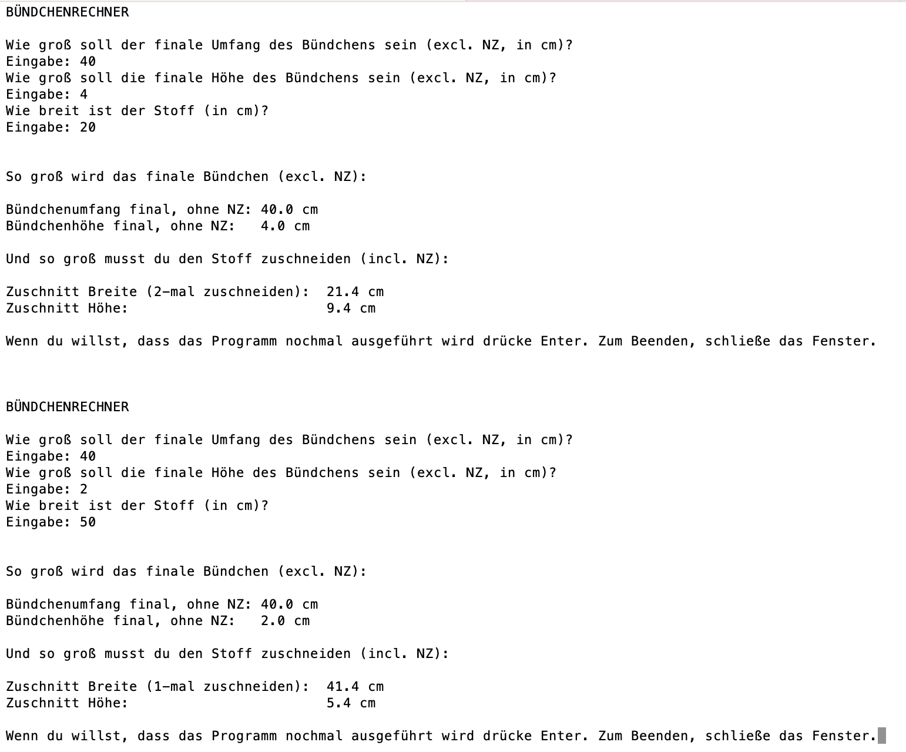

# Info

Dieses Programm ist für Hobbynäher gedacht und berechnet auf Basis des vorhandenen Stoffes, wie groß man seinen Bündchenstoff zuschneiden muss.

Dafür fragt es zuerst die gewünschten finalen Maße des Bündchens ab sowie die Breite des zur Verfügung stehenden Stoffes.

Danach stellt es die Usereingaben noch einmal übersichtlich dar.

Nun berechnet es den genauen Zuschnitt (und rechnet die benötigte Nahtzugabe (0,7 cm) dazu).
Dabei wird geprüft, ob die gewünschte Breite größer/gleich oder kleiner ist als der vorhandene Stoff, und dementsprechend wird ausgerechnet, ob man das Bündchen in einem oder in zwei Teilen zuschneiden muss.

# Screenshot

